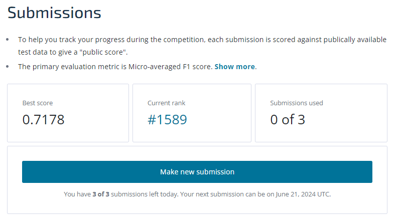

# Business Challenge: Machine Learning

## Introduction

Richter's Predictor: Modeling Earthquake Damage

The purpose of this project is to predict the level of damage to buildings caused by the 2015 Gorkha earthquake in Nepal based on aspects of building location and construction.

This is a public challenge that can be found at https://www.drivendata.org/competitions/57/nepal-earthquake/page/136/

## Project Overview

The purpose of the challenge is to predict the ordinal variable damage_grade, which represents a level of damage to the building that was hit by the earthquake. There are 3 grades of the damage:
	1 represents low damage
	2 represents a medium amount of damage
	3 represents almost complete destruction

The dataset mainly consists of information on the buildings' structure and their legal ownership. Each row in the dataset represents a specific building in the region that was hit by Gorkha earthquake.

There are 39 columns in this dataset, where the building_id column is a unique and random identifier. The remaining 38 features are described in the section below. Categorical variables have been obfuscated random lowercase ascii characters. The appearance of the same character in distinct columns does not imply the same original value.

## Deliverables

1. **Python Code:** Python code with the model
2. **Datasets folder** Containing two datasets for training (training values and training labels), dataset for testing, and the dataset submitted with the predictions. 

## Final score after submissions
Best F1 score: 0.7178

